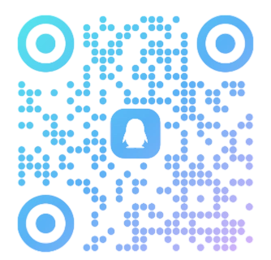

# 🤔 这是什么？

欢迎访问大连民族大学 ACM 工作室的公共仓库。本仓库面向校内所有对算法竞赛、程序设计感兴趣的同学开放。仓库存放有常用算法模板、算法笔记、辅助工具、校内比赛题目题解和工作室获得的各类奖项等。

如果你是：

- 对算法竞赛有兴趣的同学
- 想要入门数据结构与算法的同学
- 正在/想要准备XCPC、蓝桥杯、百度之星或天梯赛等竞赛的同学

那么这个仓库里的内容对你一定很有用！

## 🚀 学习资源

### OJ平台

- [牛客竞赛](https://ac.nowcoder.com/)
- [洛谷](https://www.luogu.com.cn/)
- [PTA](https://pintia.cn/problem-sets/dashboard)
- [蓝桥云课](https://www.lanqiao.cn/oj-contest/)
- [Leetcode](https://leetcode.cn/)
- [CodeForces](https://codeforces.com/)
- [Atcoder](https://atcoder.jp/)

### 教程资料

- [OI-WIKI](https://oi-wiki.org/)
- [如何准备icpc](https://www.geeksforgeeks.org/blogs/how-to-prepare-for-acm-icpc/)
- [校招面试指南](https://github.com/jwasham/coding-interview-university)

### 书籍

待补充

## 📚 相关资料

工作室成员在使用的算法模板：

- [WIDA's XCPC algorithm template](算法模板/WIDA-XCPC-v1.8.8-2024.11.19.pdf)
- [Jiangly templates](算法模板/Jiangly-templates.pdf)

## 🔧 辅助工具

### 浏览器汉化插件
国外OJ平台 (如 Codeforces 和 Atcoder) 题目没有中文，这对于英语苦手很不友好，以下是一些可以翻译网页翻译题目的插件：

- [Codeforces-Better](tools/浏览器插件/Codeforces-Better!-1.79.0.user.js)
- [Atcoder-Better](tools/浏览器插件/Atcoder-Better!-1.19.0.user.js)
- [Nowcoder-Better](tools/浏览器插件/Nowcoder-Better!-1.12.0.user.js)

#### 安装方法：

- 方法一：打开篡改猴，添加新脚本，把上方对应代码复制进去。
- 方法二：前往[官方仓库](https://github.com/beijixiaohu/OJBetter)下载。

翻译服务推荐使用 DeepL 的 api 模式，相对于其他服务更加稳定且精确。
可以使用工作室的DeepL-free-api:
```sh
933004b5-149e-4666-868f-1959bc5e7989:fx
```

## 📢 加入我们

如果你热爱算法竞赛、喜欢挑战、愿意学习，欢迎通过以下方式了解并加入我们：

- 校内交流群：QQ-897429417
- 2025届新生纳新群

